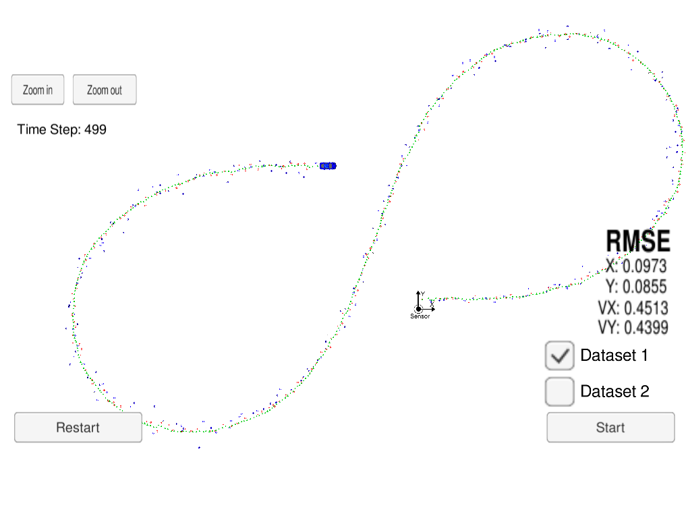
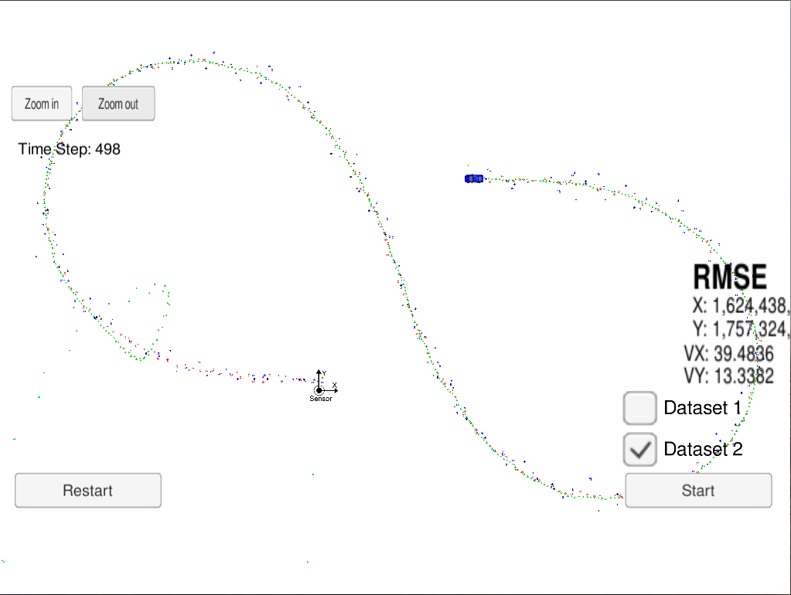
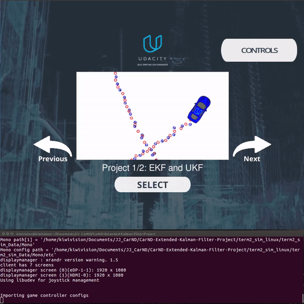
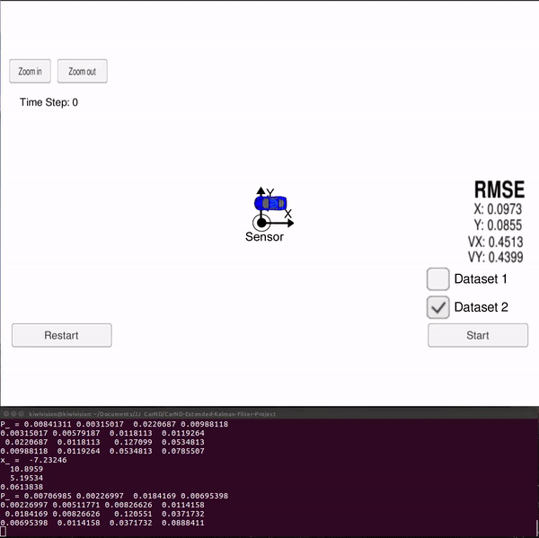

# Extended Kalman Filter Project Starter Code

## Overview

In this project, I used my knowledge about how the extended Kalman filter works, then, I implemented the extended Kalman filter in C++. Udacity provide all the simulated lidar and radar measurements detecting a bicycle that travels around the vehicle. The main objective is use a Kalman filter, lidar measurements and radar measurements to track the bicycle's position and velocity.

Lidar measurements are red circles, radar measurements are blue circles with an arrow pointing in the direction of the observed angle, and estimation markers are green triangles. 
The video below shows what the simulator looks like when a c++ script is using its Kalman filter to track the object. 
The objective of the project is based on [project rubric](https://review.udacity.com/#!/rubrics/1962/view). 

[EKF Project video](https://www.youtube.com/watch?v=d6qbR3_LPoA)

## How Extended Kalman Filter works.

Basically, when we implement a EKF (Extended Kalman Filter) we need to initialize, predict and update the variables. The basic step-by-step is described below.
* Initializing Kalman filter variables.
* Predicting where the object is going to be after a time step Δt.
* Updating where the object is based on sensor measurements.

To guarantee that the EKF will meet specifications, we calculate the RMS (root mean squared error).

## Github Files - src folder:

The files you will find in the src folder are the following.

* [main.cpp](LINK) - This file communicates with the Term 2 Simulator that receive data.measurements, calls the function to run the Kalman filter and calls the function to calculate RMS.
* [FusionEKF.cpp](LINK) - Thi file initializes the filter EFK, calls the predict function and calls the update function.
* [kalman_filter.cpp](LINK) - This file defines the predict function, the update function for lidar, and the update function for radar.
* [tools.cpp]() - This file is in charge to defines the function to calculate RMS and the Jacobian matrix.

## Build instructions and dependencies

This project involves the Term 2 Simulator which can be downloaded [here](https://github.com/udacity/self-driving-car-sim/releases).

This repository includes two files that can be used to set up and install [uWebSocketIO](https://github.com/uWebSockets/uWebSockets) for either Linux or Mac systems. For windows you can use either Docker, VMware, or even [Windows 10 Bash on Ubuntu](https://www.howtogeek.com/249966/how-to-install-and-use-the-linux-bash-shell-on-windows-10/) to install uWebSocketIO. Please see the uWebSocketIO Starter Guide page in the classroom within the EKF Project lesson for the required version and installation scripts.

Once the install for uWebSocketIO is complete, the main program can be built and run by doing the following from the project top directory.

1. Clone this repo.
2. Make a build directory: `mkdir build && cd build`
3. Compile: `cmake .. && make` 
   * On windows, you may need to run: `cmake .. -G "Unix Makefiles" && make`
4. Run it: `./ExtendedKF `

Tips for setting up your environment can be found in the classroom lesson for this project.

Note that the programs that need to be written to accomplish the project are src/FusionEKF.cpp, src/FusionEKF.h, kalman_filter.cpp, kalman_filter.h, tools.cpp, and tools.h

The program main.cpp has already been filled out, but feel free to modify it.

Here is the main protocol that main.cpp uses for uWebSocketIO in communicating with the simulator.

INPUT: values provided by the simulator to the c++ program

        ["sensor_measurement"] => the measurement that the simulator observed (either lidar or radar)

OUTPUT: values provided by the c++ program to the simulator

        ["estimate_x"] <= kalman filter estimated position x  
        ["estimate_y"] <= kalman filter estimated position y  
        ["rmse_x"]  
        ["rmse_y"]  
        ["rmse_vx"]  
        ["rmse_vy"]  

## Other Important Dependencies

* cmake >= 3.5
  * All OSes: [click here for installation instructions](https://cmake.org/install/)
* make >= 4.1 (Linux, Mac), 3.81 (Windows)
  * Linux: make is installed by default on most Linux distros
  * Mac: [install Xcode command line tools to get make](https://developer.apple.com/xcode/features/)
  * Windows: [Click here for installation instructions](http://gnuwin32.sourceforge.net/packages/make.htm)
* gcc/g++ >= 5.4
  * Linux: gcc / g++ is installed by default on most Linux distros
  * Mac: same deal as make - [install Xcode command line tools](https://developer.apple.com/xcode/features/)
  * Windows: recommend using [MinGW](http://www.mingw.org/)

## Data File for EKF project

Each row represents a sensor measurement where the first column tells if the measurement comes from radar (R) or lidar (L).

For a row containing radar data, the columns are: sensor_type, rho_measured, phi_measured, rhodot_measured, timestamp, x_groundtruth, y_groundtruth, vx_groundtruth, vy_groundtruth, yaw_groundtruth, yawrate_groundtruth.

For a row containing lidar data, the columns are: sensor_type, x_measured, y_measured, timestamp, x_groundtruth, y_groundtruth, vx_groundtruth, vy_groundtruth, yaw_groundtruth, yawrate_groundtruth.

Whereas radar has three measurements (rho, phi, rhodot), lidar has two measurements (x, y).

## Results

  

  
  
